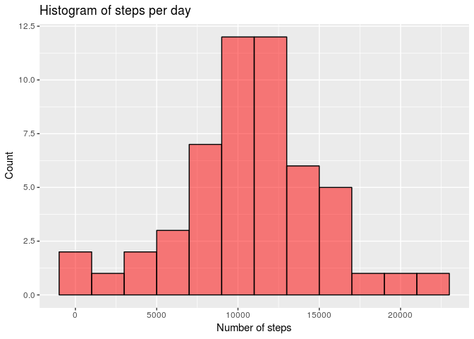
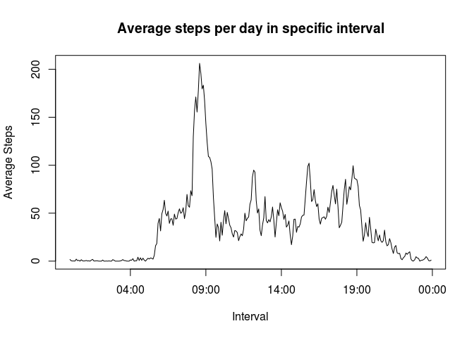
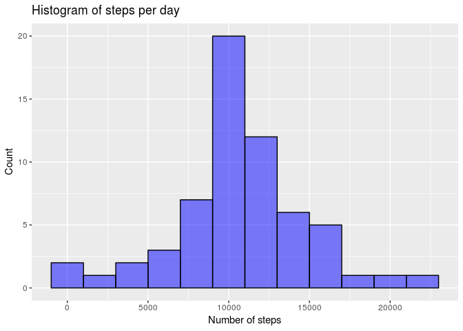
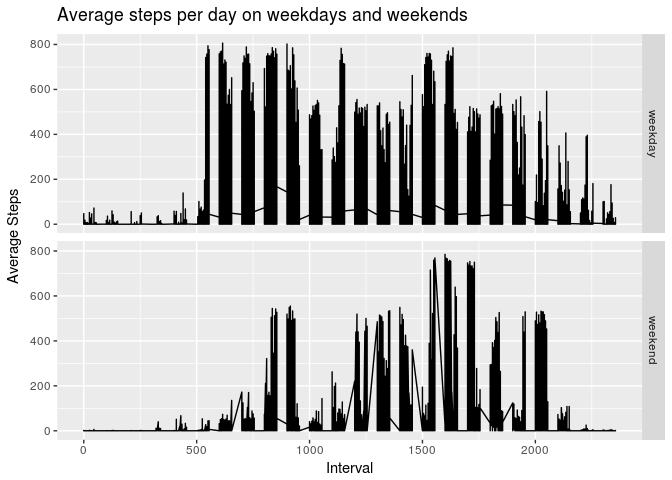

## Loading and preprocessing the data

```r
data <- read.csv(unz("activity.zip", "activity.csv"))
data_complete <- data[complete.cases(data), ]
```

## What is mean total number of steps taken per day?

```r
steps_per_day <- as.data.frame(tapply(data_complete$steps, data_complete$date, sum))
names(steps_per_day) <- 'steps_sum'
library(ggplot2)
ggplot(steps_per_day, aes(steps_sum)) + geom_histogram(binwidth = 2000, na.rm = T, col = 'black', fill = 'red', alpha = 0.5) +
    labs(title = 'Histogram of steps per day', x = 'Number of steps', y = 'Count')
```

<!-- -->

```r
## calculating mean and median
mean0 <- as.integer(mean(steps_per_day$steps_sum, na.rm = T))
median0 <- median(steps_per_day$steps_sum, na.rm = T)
```

The mean of the total number of steps taken per day is 10766.  
The median of the total number of steps taken per day is 10765.

## What is the average daily activity pattern?

```r
ave <- as.data.frame(tapply(data_complete$steps, data_complete$interval, mean))
ave <- cbind(rownames(ave), ave)
names(ave) <- c('interval', 'average_steps')

## changing the interval into date and time format
ave$interval <- sprintf('%04d', as.numeric(as.character(ave$interval)))
ave$interval <- paste(substr(ave$interval, 1, 2), substr(ave$interval, 3, 4), sep = ':')
ave$interval <- as.POSIXct(ave$interval, format = '%H:%M')

## plotting
with(ave, plot(interval, average_steps, type = 'l', xlab = 'Interval', ylab = 'Average Steps', 
               main = 'Average steps per day in specific interval'))
```

<!-- -->

```r
max = ave$interval[ave$average_steps == max(ave$average_steps)]
max = strftime(max, format = '%H:%M')
```

The maximum number of steps per day are taken in the interval of 08:35

## Imputing missing values

```r
missing <- sum(!complete.cases(data))
```

The number of missing values in the data sets is 2304


```r
for(i in 1:length(data$steps)){
    if(is.na(data$steps[i]) == TRUE){
        if(i %% length(ave$average_steps) != 0){
            data$steps[i] <- ave$average_steps[i %% length(ave$average_steps)]
        }
        if(i %% length(ave$average_steps) == 0){
            data$steps[i] <- ave$average_steps[length(ave$average_steps)]
        }
    }
}

## making histogram
steps_imput <- as.data.frame(tapply(data$steps, data$date, sum))
names(steps_imput) <- 'steps_sum'
ggplot(steps_imput, aes(steps_sum)) + geom_histogram(binwidth = 2000, na.rm = T, col = 'black', fill = 'blue', alpha = 0.5) + 
    labs(title = 'Histogram of steps per day', x = 'Number of steps', y = 'Count')
```

<!-- -->

```r
## calculating mean and median after imput
mean1 <- as.integer(mean(steps_imput$steps_sum, na.rm = T))
median1 <- as.integer(median(steps_imput$steps_sum, na.rm = T))
```

The new mean and median is 10766 and 10766 respectively.  
The mean stays the same because the missing value was replaced by a mean value of steps taken in the same interval for other days  
The median slightly moved since there is more data point around the original value

## Are there differences in activity patterns between weekdays and weekends?

```r
## creating the days factor column
data$date <- as.POSIXct(data$date, format = '%Y-%m-%d')
data$days <- weekdays(data$date)
for(i in 1:length(data$days)){
    if(data$days[i] == 'Saturday' || data$days == 'Sunday'){
        data$days[i] <- 'weekend'
    }
    else {
        data$days[i] <- 'weekday'
    }
}
data$days <- as.factor(data$days)

## plotting
ggplot(data, aes(interval, steps, group = days)) + 
    geom_line() + 
    facet_grid(days~.) + 
    labs(x = 'Interval', y = 'Average Steps', title = 'Average steps per day on weekdays and weekends')
```

<!-- -->

The steps taken during weekends are more skewed towards afternoon time
